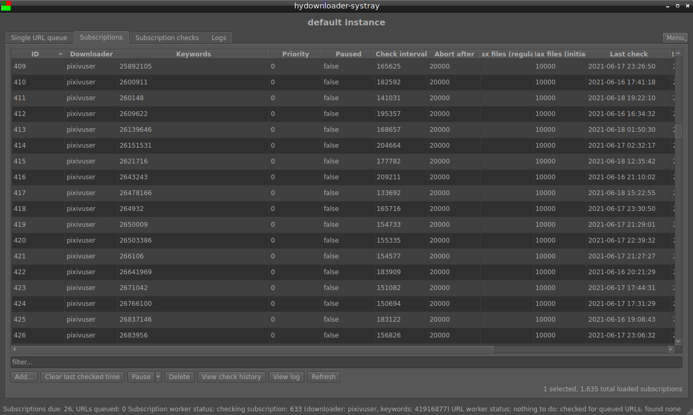

# hydownloader-systray

Remote management GUI for hydownloader.

## What is this and how it works?

This is a graphical applications to remotely manage hydownloader instances.
After setting the hydownloader API address and access key, this can be used to manage URLs, manage subscriptions,
view subscription check history and logs or do basic maintenance actions.



## Installation instructions

### Windows

You can download an up-to-date build from the releases page.
Just extract the zip file, no installation needed (see below on how to configure and launch it).

### Linux and other platforms

You will have to compile from source. For this, you will need cmake and Qt6 (and a C++ compiler).
Arch (or Artix) Linux users can use the PKGBUILD included in this repository.

Build commands after cloning this repo:
```
cd hydownloader-systray
mkdir build
cd build
cmake ..
make
```

## How to use

### Configuration

The first step is to customize `settings.ini`.
At the very least, you should double check the values of `accessKey`, `apiURL`, `aggressiveUpdates` and `localConnection`.
A table of configuration keys and their explanations follows.

| Key | Possible values | Explanation |
|-----|-----------------|-------------|
| instanceNames | A name or a comma-separated list of names | You only need to change this if you want to access multiple hydownloader instances. Each instance is identified by its name in hydownloader-systray. You can use any names you want (except that they can't contain commas). |
| accessKey | An access key or a comma-separated list of access keys | Access key(s) for your hydownloader instance(s). Must match the key set in the hydownloader configuration. If using multiple instances, make sure to list as many keys as you have instance names. |
| apiURL | A URL or a comma-separated list of URLs | URL(s) of your hydownloader instance(s). If using multiple instances, make sure to have as many URLs as access keys and instance names and that the URL and its corresponding access key is at the same position in the list. |
| defaultTests | Comma-separated list of test names (see the help of `hydownloader-tools` and the hydownloader docs for info on testing). | These will be prefilled in the input box when starting tests from hydownloader-systray. |
| defaultDownloaders | Comma-separated list of hydownloader subscription downloader names. | Items from this list will be offered when editing subscriptions in hydownloader-systray. The default value contains all sites supported by hydownloader, so it only makes sense to edit this if you want to remove some sites you don't use. |
| defaultSubCheckInterval | integer | Default subscription check interval in hours (prefilled when adding subscriptions). |
| applyDarkPalette | true or false | Enable a basic dark theme. Might look incomplete on some systems. |
| updateInterval | integer | How often should hydownloader-systray query the hydownloader daemon for status and data updates. Value in milliseconds. The default value works well for a hydownloader daemon that runs on the same machine as hydownloader-systray. |
| startVisible | true or false | Whether hydownloader-systray should start with the main window visible or minimized to systray. |
| aggressiveUpdates | true or false | If true, hydownloader-systray will not only query the hydownloader daemon for status updates (according to the `updateInterval`), but will also refresh the subscription, URL and subscription check lists. This leads to much more network traffic and load on the hydownloader daemon but also a much better user experience. If this is set to false, you will have to refresh the displayed data manually by clicking the refresh button. |
| localConnection | true or false | Set this to true if hydownloader-systray is running on the same machine as hydownloader-daemon. This will enable some features that only make sense in this case, like opening download folders directly from hydownloader. |

### Launching hydownloader-systray

When started, hydownloader-systray will look for and load a `settings.ini` in the same folder as the executable.
If no `settings.ini` is found there, it will fail to start.
You can use a command line argument to specify the path of the configuration file.

Command line arguments:

* `--settings <filename>`: specify location of settings file
* `--startVisible`: start with the main window visible

### Using hydownloader-systray

Click on the system tray icon to open the main window. There you will find a list of URLs and subscriptions.
Subscription check history and logs can also be loaded.

Most cells in the URLs and subscriptions tables are editable. It is also possible to add and delete URLs and subscriptions.
The tables can be filtered using the filter textboxes (which also accept regex).
See the hydownloader documentation for an explanation on basic hydownloader concepts and what each column means in the tables.

Right-clicking on the tray icon will open a menu with some management actions. Hovering on the tray icon will show a tooltip with the current status of the hydownloader daemon.

Important note: the "shutdown" action will NOT shut down the hydownloader daemon instantly.
It will first finish the currently running URL download and subscription check (if there are any), then shut down cleanly.
If you want to shut down the hydownloader daemon instantly, pause subs and URL downloads, then use the force abort options to stop any that is still running and only after that use the shutdown action.
While the hydownloader daemon can handle this fine with no data loss, it is still recommended to do a normal clean shutdown.

The tray icon itself is a simulated 2x2 LED matrix where the colors correspond to the current status of the hydownloader daemon.
The top row shows subscription downloader status, while the bottom row shows URL downloader status. The left side shows status information, while the right side is color-coded according to the number of items in the download/check queue.
For example, the top right quarter of the tray icon is color-coded according to the number of subscriptions that are waiting to be checked.

The URL/subscription worker statuses (the left side) have the following color coding:
| Color | Meaning |
|-------|---------|
| (bright) green | OK, nothing to do |
| dark green | OK, download/subscription check in progress |
| yellow | paused |
| gray | no information or the worker is not running |
| red | not recognized / error |

The queue sizes (the right side) are color coded as:
| Color | Number of URLs/subscriptions waiting |
|-------|---------|
| (bright) green | 0 |
| dark green | <= 5 |
| yellow | <= 10 |
| dark yellow | <= 20 |
| (bright) red | <= 50 |
| dark red | > 50 |

There is also a special case where the whole square is (bright) red, which means that there is no contact with the hydownloader daemon or some other serious error occurred.

## TODO

* Color the rows of the log view according to severity
* Add icon and desktop file
* Add log rotation

## License

hydownloader-systray is licensed under the Affero General Public License v3+ (AGPLv3+).
